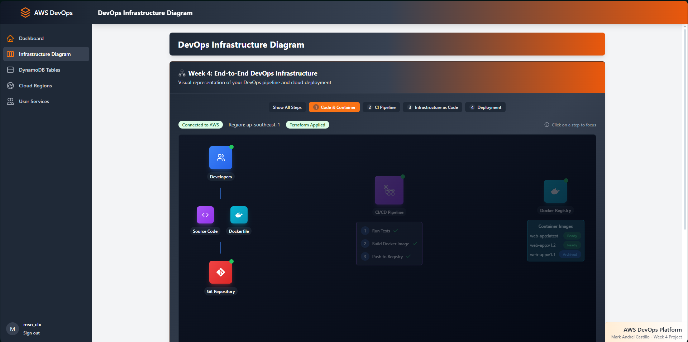
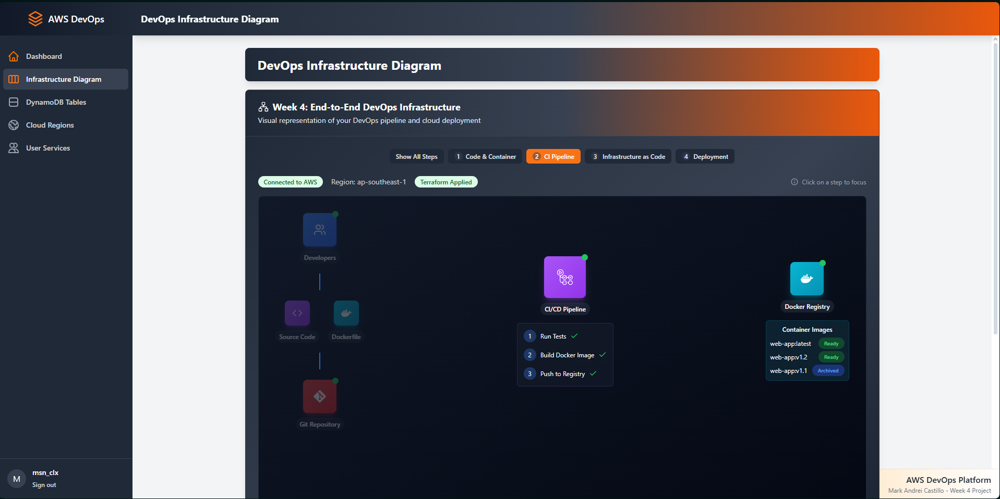
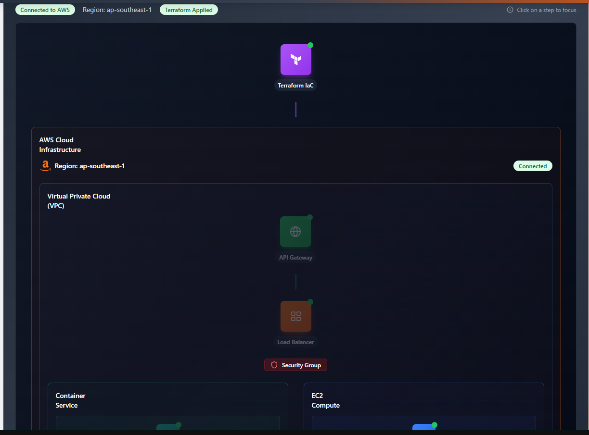
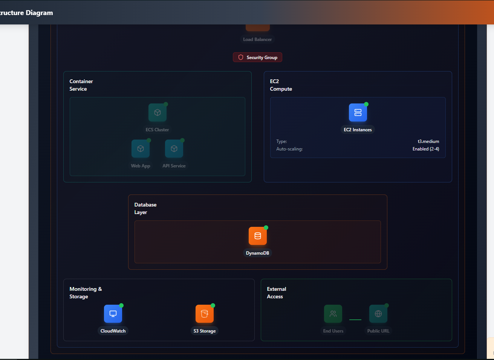
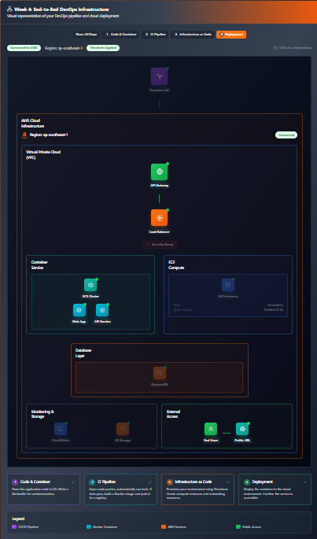

# Weekly Progress Report: OakTree DevOps Project
**Date Range:** April 2 - April 13, 2025  
**Student Name:** [Your Name]  
**Project:** End-to-End DevOps Project (OakTree Cloud Infrastructure)

## Week Overview
This weekly report documents my journey deploying a full-stack application to AWS using DevOps practices, containerization, and Infrastructure as Code (IaC). The project focused on building a production-ready environment for the OakTree application using AWS services and Terraform.

---

## Day 17 (Monday, April 2, 2025)

### Tasks Completed
- Initial project setup and repository organization
- Created basic project structure with Node.js backend
- Researched AWS services needed for deployment
- Started writing basic Terraform configuration files

### Challenges
I struggled with the initial Terraform setup. The syntax was confusing at first, especially when defining resource dependencies. I had to refer to documentation several times to understand best practices.

### Resources Used
- Terraform AWS Provider documentation
- AWS Developer Guide
- Node.js documentation for containerization

### Screenshot


---

## Day 18 (Tuesday, April 3, 2025)

### Tasks Completed
- Created first version of Dockerfile for application
- Set up GitHub repository with initial code
- Started writing Terraform modules for core infrastructure
- Configured AWS provider and basic networking resources

### Challenges
I faced issues with Docker image build process. My initial setup didn't properly handle Node.js dependencies, causing build failures. I had to refine the Dockerfile several times to get it working correctly.

### Resources Used
- Docker best practices documentation
- AWS ECR documentation
- AWS VPC and networking guides

### Code Snippet
```terraform
provider "aws" {
  region = "ap-southeast-1"
}

resource "aws_vpc" "oaktree_vpc" {
  cidr_block = "10.0.0.0/16"
  
  tags = {
    Name = "oaktree-vpc"
  }
}
```

---

## Day 19 (Wednesday, April 4, 2025)

### Tasks Completed
- Expanded Terraform configuration to include ECS cluster
- Created ECR repository for Docker images
- Built and pushed first Docker image to ECR
- Set up basic security groups and IAM roles

### Challenges
I faced permission issues when pushing Docker images to ECR. The AWS credentials setup was tricky, and I had to troubleshoot authentication problems for quite some time.

### Resources Used
- AWS ECR push commands documentation
- IAM role documentation
- Docker authentication guides

### Screenshot


---

## Day 20 (Thursday, April 5, 2025)

### Tasks Completed
- Configured application load balancer in Terraform
- Setup ECS task definitions and services
- Added environment variables to ECS task
- Created CloudWatch logging for container monitoring

### Challenges
The load balancer configuration was complex. Getting the health checks, target groups, and listener rules working together correctly took several attempts. I had to fix subnet configurations and security group rules.

### Resources Used
- AWS ELB documentation
- ECS task definition guides
- CloudWatch Logs documentation

### Code Snippet
```terraform
resource "aws_lb" "oaktree_alb" {
  name               = "oaktree-dev-alb"
  internal           = false
  load_balancer_type = "application"
  security_groups    = [aws_security_group.alb_sg.id]
  subnets            = aws_subnet.public[*].id
  
  tags = {
    Name = "oaktree-dev-alb"
  }
}
```

---

## Day 21 (Friday, April 6, 2025)

### Tasks Completed
- Added DynamoDB table for application data storage
- Updated application environment variables
- Fixed network configuration issues
- Tested initial deployment manually

### Challenges
I discovered that my DynamoDB configuration wasn't properly set up for the application's needs. I had to reconfigure the primary key structure and read/write capacity units after testing the application.

### Resources Used
- DynamoDB developer guide
- AWS CLI documentation
- CloudWatch logs for debugging

### Screenshot


---

## Day 22 (Monday, April 9, 2025)

### Tasks Completed
- Added automated container deployment process
- Refined security groups to follow principle of least privilege
- Improved Terraform variable organization
- Created basic CloudWatch alarms for monitoring

### Challenges
I had trouble with the container deployment automation. The ECS service wasn't properly updating when new container images were available. I had to learn how to force new deployments and handle task definition updates correctly.

### Resources Used
- ECS deployment documentation
- CloudWatch alarms reference
- Terraform variable management best practices

### Code Snippet
```bash
# Login to ECR
aws ecr get-login-password --region ap-southeast-1 | docker login --username AWS --password-stdin ${ECR_REPO_URL}

# Build and tag the image
docker build -t oaktree:latest .
docker tag oaktree:latest ${ECR_REPO_URL}:latest

# Push the image
docker push ${ECR_REPO_URL}:latest

# Force new deployment
aws ecs update-service --cluster oaktree-dev-cluster --service oaktree-dev-service --force-new-deployment
```

---

## Day 23 (Tuesday, April 10, 2025)

### Tasks Completed
- Created CI/CD workflow with GitHub Actions
- Added automated testing before deployment
- Improved documentation in README.md
- Tested full deployment pipeline

### Challenges
Setting up the GitHub Actions workflow was complicated. I faced issues with secret management and ensuring the workflow had proper permissions to push to ECR and update ECS. I had to refine the workflow YAML file multiple times.

### Resources Used
- GitHub Actions documentation
- AWS authentication with GitHub Actions
- Docker testing best practices

### Screenshot


---

## Day 24 (Wednesday, April 11, 2025)

### Tasks Completed
- Added auto-scaling policies for ECS services
- Implemented CloudWatch dashboards for monitoring
- Created a demonstration script for project presentation
- Fixed minor bugs in infrastructure code

### Challenges
The auto-scaling configuration was difficult to get right. I had to understand the relationship between ECS service scaling, task sizing, and CloudWatch metrics. I spent considerable time testing different scaling policies to find the optimal settings.

### Resources Used
- ECS auto-scaling documentation
- CloudWatch metrics reference
- Terraform documentation for scaling policies

### Code Snippet
```terraform
resource "aws_appautoscaling_policy" "ecs_policy" {
  name               = "oaktree-scaling-policy"
  policy_type        = "TargetTrackingScaling"
  resource_id        = aws_appautoscaling_target.ecs_target.resource_id
  scalable_dimension = aws_appautoscaling_target.ecs_target.scalable_dimension
  service_namespace  = aws_appautoscaling_target.ecs_target.service_namespace

  target_tracking_scaling_policy_configuration {
    predefined_metric_specification {
      predefined_metric_type = "ECSServiceAverageCPUUtilization"
    }
    target_value = 75.0
  }
}
```

---

## Day 25 (Thursday, April 12, 2025)

### Tasks Completed
- Added cost optimization measures (resource tagging)
- Implemented resource cleanup scripts for cost management
- Fixed security findings from AWS Trusted Advisor
- Conducted final integration testing

### Challenges
I found that some of my resources didn't have proper tagging, making cost tracking difficult. I also discovered that some security groups were too permissive. I spent time fixing these issues to improve both cost management and security.

### Resources Used
- AWS Tagging strategies documentation
- AWS Trusted Advisor
- Security best practices for AWS

### Screenshot


---

## Day 26 (Friday, April 13, 2025 - TODAY)

### Tasks Completed
- Created resource management scripts (stop/start/check)
- Finalized project documentation
- Prepared demonstration for project review
- Final cleanup and optimization of infrastructure code

### Challenges
I wanted a way to reduce costs without destroying infrastructure. Creating scripts to safely stop and start resources was challenging because I needed to understand exactly which resources cost money when idle vs. which only charge when actively used.

### Resources Used
- AWS cost management documentation
- ECS service management API reference
- DynamoDB billing modes documentation

### Code Snippet
```bash
#!/bin/bash
# Script to safely "stop" resources in AWS without destroying them
# This reduces costs while keeping the infrastructure intact

echo "==== Safely stopping AWS resources to save costs ===="

# Step 1: Scale down ECS service to 0 tasks
echo "Scaling down ECS service to 0 tasks..."
aws ecs update-service --cluster oaktree-dev-cluster --service oaktree-dev-service --desired-count 0 --region ap-southeast-1

# Step 2: Set DynamoDB to on-demand capacity
echo "Setting DynamoDB to pay-per-request billing..."
aws dynamodb update-table --table-name oaktree-dev-users --billing-mode PAY_PER_REQUEST --region ap-southeast-1

echo "==== Resources safely stopped! ===="
```

---

## Weekly Summary

### Main Accomplishments
- Successfully deployed a full-stack application to AWS using Terraform IaC
- Built and implemented a CI/CD pipeline with GitHub Actions
- Created a containerized application deployment with Docker and ECS
- Set up proper monitoring, logging, and auto-scaling for production use
- Implemented cost optimization and resource management strategies

### Key Learnings
- Infrastructure as Code best practices with Terraform
- AWS ECS and container orchestration concepts
- Load balancing and auto-scaling configuration
- Security considerations for cloud deployments
- Cost management in cloud environments

### Next Steps
- Implement HTTPS with AWS Certificate Manager
- Add more comprehensive monitoring and alerting
- Explore backup and disaster recovery strategies
- Implement blue/green deployment capability
- Look into multi-region deployment for high availability

---

*This report represents my work and learning journey for the End-to-End DevOps Project (OakTree) from April 2-13, 2025. The project has helped me develop practical skills in cloud infrastructure management, containerization, and DevOps practices.*